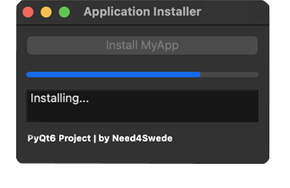

# App Installer

'Installs' and application by copying an executable from one directory to another (and creates a desktop shortcut [Windows Only])

DESIGN:
- Horizontially lined window with stacked UI elements

FUNCTIONALITY:
- Standard Buttons
- Text Output
- Progress Bar
- Install, Update and Uninstall

CREDITS:
- Mike Afshari (need4swede)
- https://mafshari.work
- https://github.com/need4swede

### Preview

