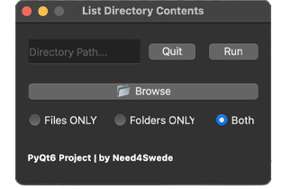

# List Directory Contents

DESIGN:
- Horizontially lined window with stacked UI elements
- Always on top GUI

FUNCTIONALITY:
- Text Input
- Standard Buttons
- Radio Buttons
- Child Window
- Directory Browser

PURPOSE:
Returns a list of files, folders or both within a given directory

CREDITS:
- Mike Afshari (need4swede)
- https://mafshari.work
- https://github.com/need4swede

### Preview

