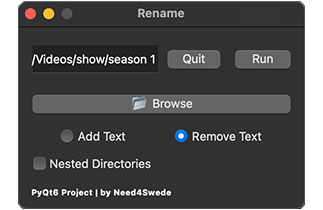

# Rename

Add / Remove text from all filenames within a directory, or within a set of nested directories

DESIGN:
- Horizontally shaped window with stacked UI elements
- Small and concise
- Always on top GUI

FUNCTIONALITY:
- Text Input
- Buttons
- Radio Buttons
- Child Window
- Directory Browser

CREDITS:
- Mike Afshari (need4swede)
- https://mafshari.work
- https://github.com/need4swede

### Preview

