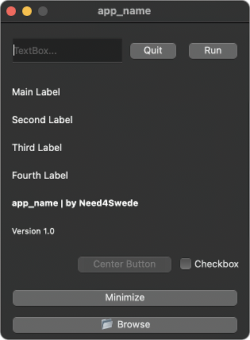

## Small - Vertical

DESIGN:
- Vertically shaped window with stacked UI elements
- Capable of collapsing and expanding
- Always on top GUI

FUNCTIONALITY:
- Text Input
- Buttons
- Checkbox
- Child Window
- Directory Browser

CREDITS:
Mike Afshari (need4swede)
https://mafshari.work
https://github.com/need4swede

#### Preview

